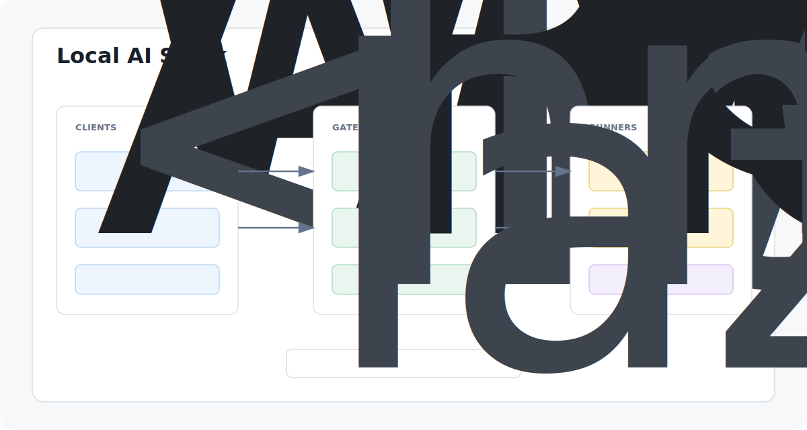
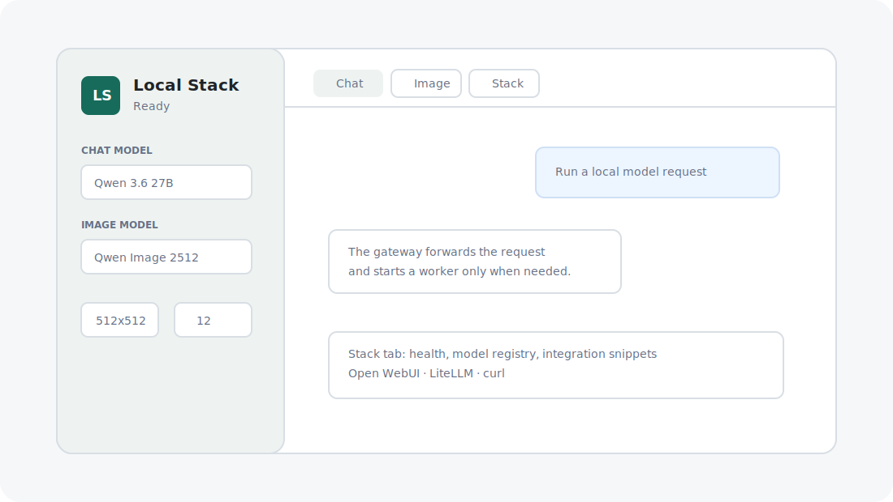
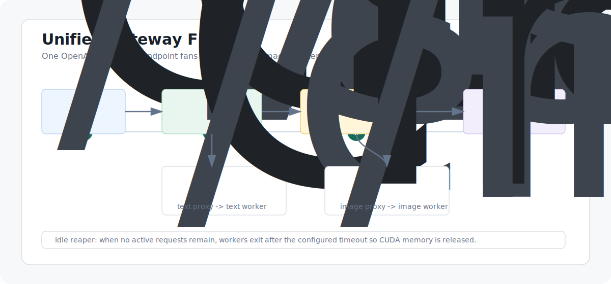

# Local AI Stack

[English](README.md) | [中文](README.zh-CN.md)



This project currently deploys `Qwen/Qwen3.6-27B` from ModelScope behind an OpenAI-compatible text chat API, while keeping the gateway and registry generic for additional local models.

The public API process is a lightweight proxy on port `8000`. It starts an internal model worker only when a chat request arrives, then stops that worker after `IDLE_UNLOAD_SECONDS` seconds without active requests. This fully releases GPU memory when idle.

## Current endpoint

- LAN base URL: `http://172.22.13.38:8000/v1`
- Local base URL: `http://127.0.0.1:8000/v1`
- API key: `sk-123456789`
- Model name: `Qwen/Qwen3.6-27B`

## Files

- Model: `models/Qwen3.6-27B`
- Public proxy: `proxy_qwen36.py`
- Internal worker: `serve_qwen36.py`
- Download script: `download_model.py`
- Start foreground: `./start.sh`
- Start background: `./start_background.sh`
- Stop: `./stop.sh`


## Visual overview





## On-demand start

To avoid keeping the API proxies resident all the time, start the Web UI and both APIs only when needed:

```bash
./api.sh
```

Then open `http://127.0.0.1:8080`. Keep that terminal open while using the Web UI or APIs. Press `Ctrl+C` to stop the Web UI, both API proxies, and any worker they started. Quick helpers:

```bash
./api.sh status
./api.sh stop
```


## Web UI and model switching

The Web UI runs on port `8080` by default and calls the local OpenAI-compatible APIs through `web_ui.py`, so the browser does not need to hold the API key directly.

Model choices are loaded from `model_registry.json`. To add another OpenAI-compatible model later, add another item with:

```json
{
  "id": "provider/model-name",
  "label": "Display name",
  "type": "chat",
  "base_url": "http://127.0.0.1:8002/v1",
  "api_key_env": "API_KEY",
  "default": false
}
```

Use `"type": "image"` for image generation models. Restart `./api.sh` after editing the registry.

## User systemd service

The service can also be managed as a user unit, but the on-demand `./api.sh` flow avoids keeping it resident:

```bash
systemctl --user status qwen36-api.service
systemctl --user stop qwen36-api.service
```

## Health

```bash
curl http://127.0.0.1:8000/health
```

`worker_running:false` means the model worker is stopped and GPU memory should be near baseline.

## Example

```bash
curl http://127.0.0.1:8000/v1/chat/completions \
  -H 'Content-Type: application/json' \
  -H 'Authorization: Bearer sk-123456789' \
  -d '{
    "model": "Qwen/Qwen3.6-27B",
    "messages": [{"role": "user", "content": "Say OK in one word."}],
    "max_tokens": 8,
    "temperature": 0,
    "extra_body": {"chat_template_kwargs": {"enable_thinking": false}}
  }'
```

## Idle behavior

Default idle timeout is 300 seconds:

```bash
IDLE_UNLOAD_SECONDS=60 ./start.sh
```

When the timeout is reached, the proxy terminates the internal worker process. This is intentional: process termination is the reliable way to release CUDA memory on this hardware.

The wrapper currently targets text chat. The upstream model is multimodal; for image/video API support use the official `transformers serve` or vLLM/SGLang on compatible hardware.


## Qwen-Image text-to-image API

`Qwen/Qwen-Image-2512` is downloaded in `models/Qwen-Image-2512` and served through an OpenAI-compatible Images API.

- LAN base URL: `http://172.22.13.38:8001/v1`
- Local base URL: `http://127.0.0.1:8001/v1`
- API key: `sk-123456789`
- Image model name: `Qwen/Qwen-Image-2512`
- Public proxy: `proxy_qwen_image.py`
- Internal worker: `qwen_image_worker.py`
- Start: `./start_qwen_image.sh`
- Stop: `./stop_qwen_image.sh`

The image API also uses lazy loading. The proxy starts the worker on the first image request and stops it after `IMAGE_IDLE_UNLOAD_SECONDS=300` seconds of inactivity. On this Tesla P40 machine, the working configuration is `IMAGE_DTYPE=float32` plus `IMAGE_DEVICE_MAP=sequential`; FP16 generated black images because Qwen-Image-2512 expects BF16-class numerics, which P40 does not support.

```bash
systemctl --user status qwen-image-api.service
systemctl --user stop qwen-image-api.service
```

Health check:

```bash
curl http://127.0.0.1:8001/health
```

Example request:

```bash
curl http://127.0.0.1:8001/v1/images/generations \
  -H "Content-Type: application/json" \
  -H "Authorization: Bearer sk-123456789" \
  -d "{\"model\":\"Qwen/Qwen-Image-2512\",\"prompt\":\"A red circle on a white background\",\"size\":\"512x512\",\"n\":1,\"response_format\":\"b64_json\",\"extra_body\":{\"num_inference_steps\":12,\"true_cfg_scale\":4.0,\"seed\":42}}"
```

Generated image files are saved under `outputs/qwen-image/`. The quick smoke test is:

```bash
.venv/bin/python smoke_test_qwen_image.py
```

## Layered local AI stack

The Web UI now also acts as a lightweight LiteLLM-style gateway. In addition to the existing direct model endpoints, external tools can use one unified OpenAI-compatible base URL:

```bash
http://127.0.0.1:8080/v1
http://172.22.13.38:8080/v1
```

Supported gateway endpoints:

```text
GET  /v1/models
POST /v1/chat/completions
POST /v1/images/generations
```

The Stack tab in the Web UI shows the active layers, model health, and copyable Open WebUI/LiteLLM/curl snippets. The design follows this split:

- Open WebUI-style UI surface: `web/` + `web_ui.py`
- LiteLLM-style gateway and routing: `web_ui.py` + `model_registry.json`
- vLLM/SGLang target layer: future high-throughput replacement for the text worker
- ComfyUI/LocalAI target layer: future workflow or multi-modal replacement for the image worker

Local reference snapshots and integration notes are in `references/`, `docs/STACK.md`, and `integrations/`.

Gateway smoke test:

```bash
./api.sh
.venv/bin/python smoke_test_gateway.py
```

